# Mockup and wireframes

The visual plan for Cybernie, updated to the finished app (v1.1, 2026-10-09).

## Mockup

Screenshots of the finished app (more to come).

### Splash and Login

  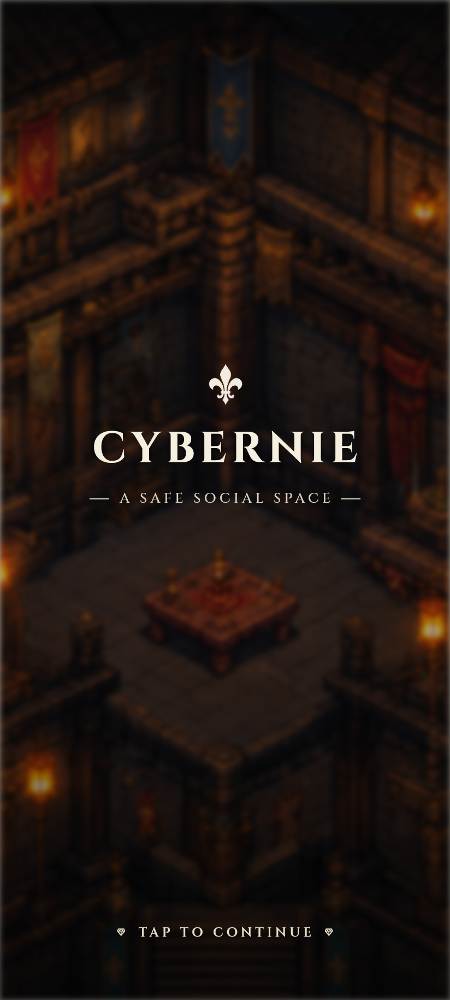
  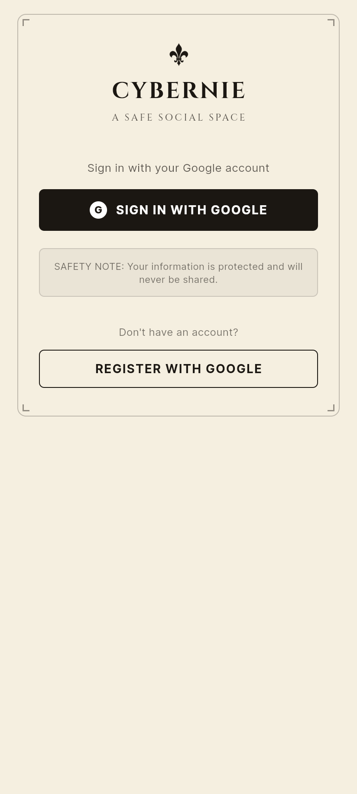
  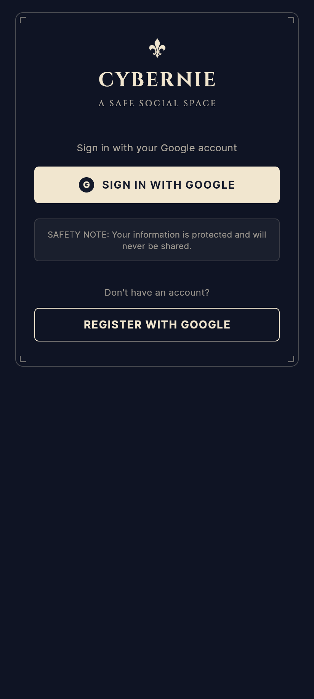

### Home, messages, friends and profile

**Home** greets you with your hero and the Join Room button, **Messages**
is a private chat with a friend (with emotes), **Friends** shows who is
online with a chat button for each, and **Profile** is where you rename
yourself, get your QR code and pick one of the six heroes.

  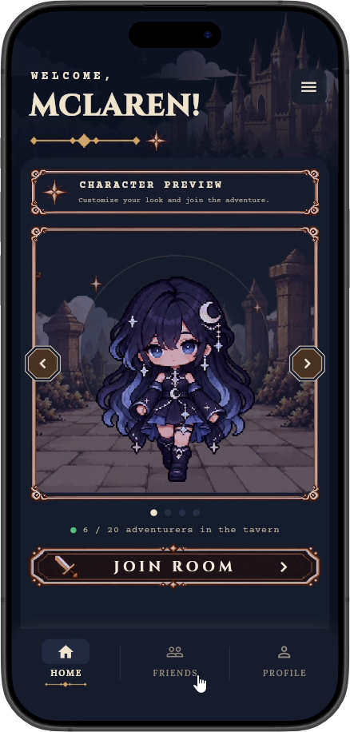
  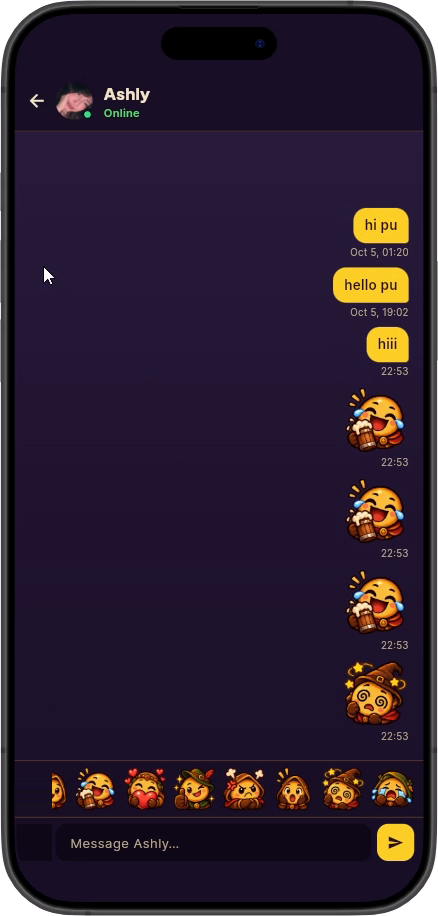
  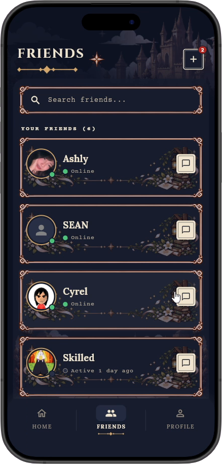
  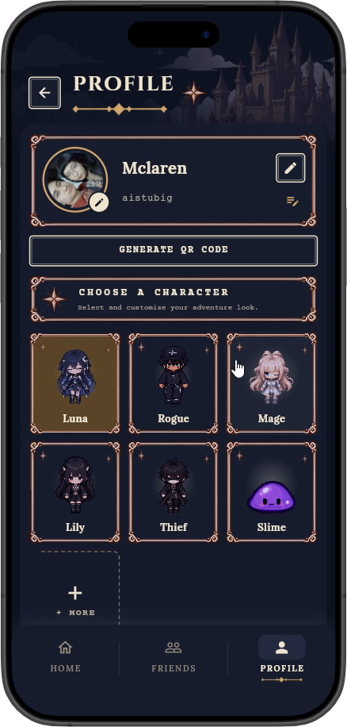

### Chat and notifications

**A message notification:** a new private message slides in at the top,
even in the middle of a blackjack hand.

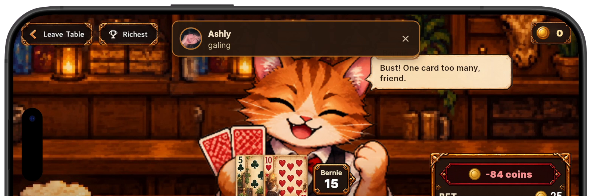

**Private chat in the tavern:** the conversation opens beside the room, so
you can keep chatting without leaving it.

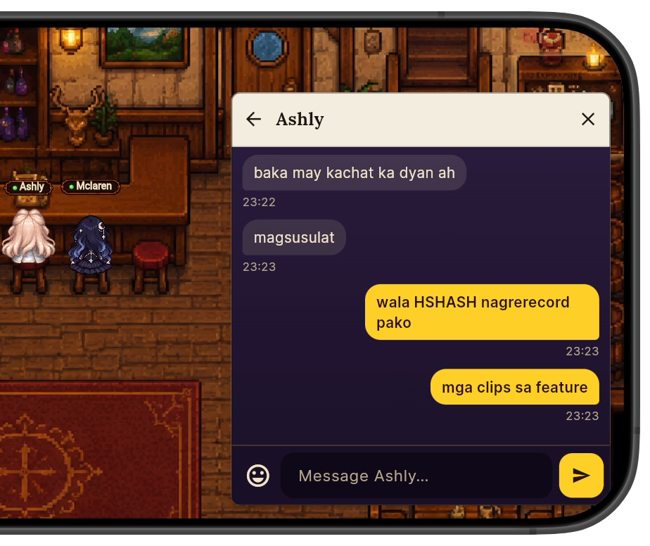

**Tavern chat:** everyone in the room can read the open chat log above the
message box.

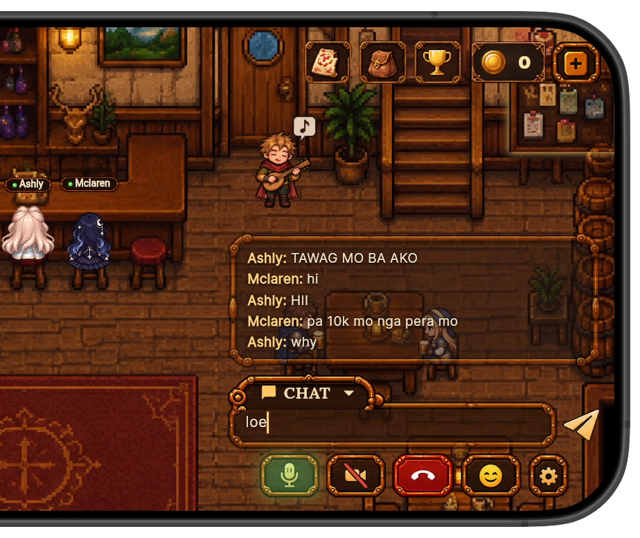

### Upstairs meeting room

Six players watching a shared game, one seated at the table:

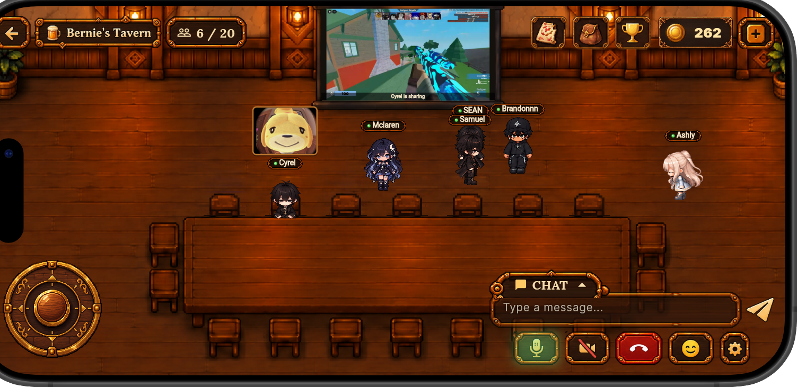

Five players seated at the table, cameras on, watching the projector:

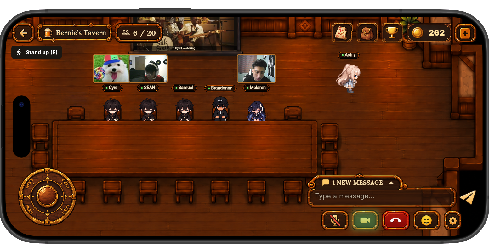

Tapping the projector shows **Share screen** and **Full screen**:

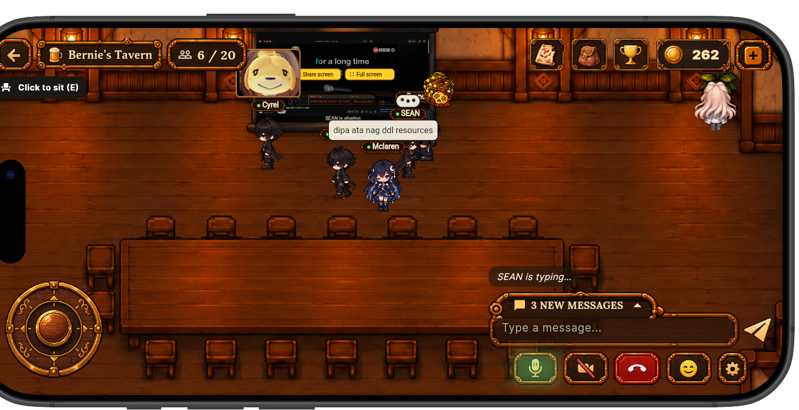

Screen sharing on the projector, with players' cameras above their heads:

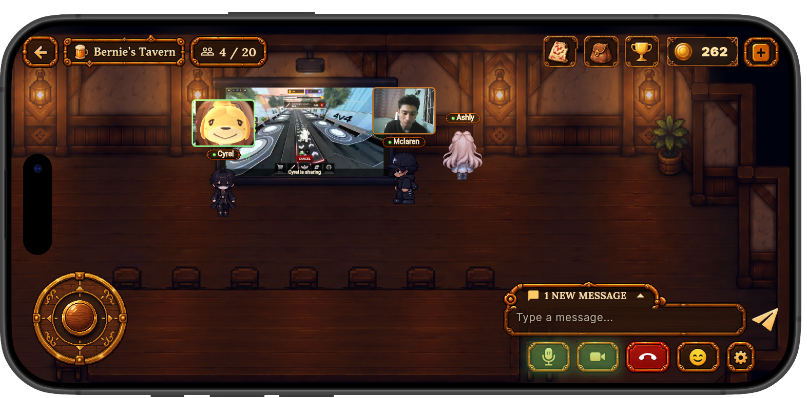

Chatting while a screen is shared:

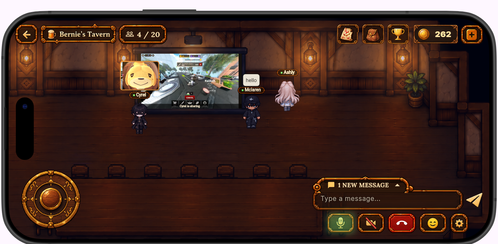

Cameras on, someone typing, and the "Click to sit" prompt near the table:

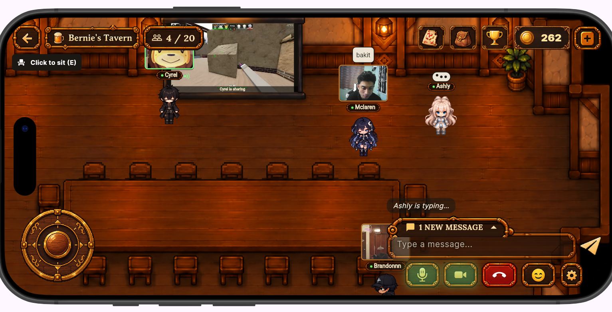

A longer chat bubble over a player:

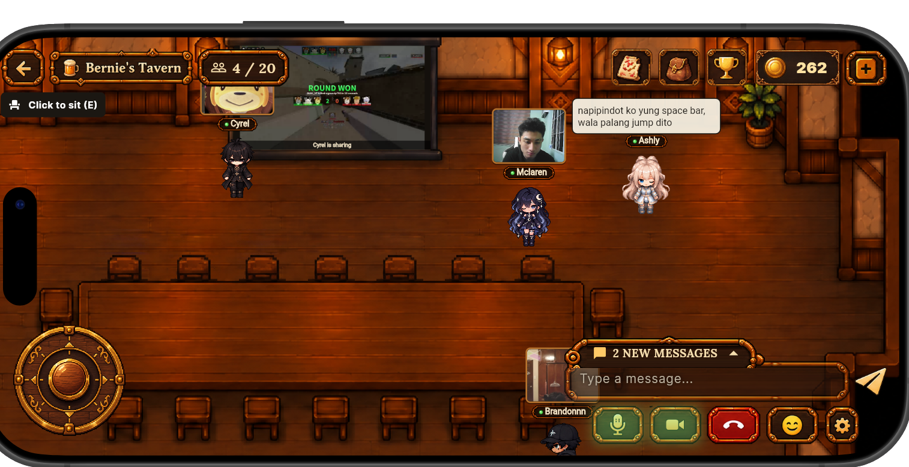

## Screen flow

Which screen opens first, and how a player moves between them. Friends, Home and
Profile are the three tabs of the bottom navigation bar.

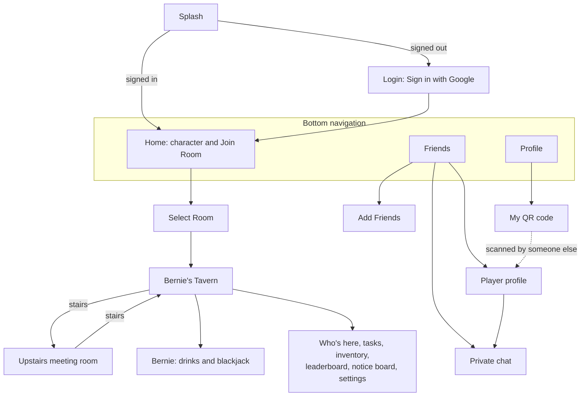

## Wireframes

_(To add: photos of the original paper or digital wireframes, saved in
`assets/`.)_

## Screens

### Splash
The Cybernie logo and title over the tavern art. Signed-in players go straight
to Home; everyone else goes to Login. A scanned profile link is remembered here
until the player has signed in.

### Login
One button: **Sign in with Google** (and **Register with Google**, which is the
same flow: the first sign-in creates the account). A short safety note explains
what is stored.

### Home (Welcome)
A greeting with the player's name and a large animated preview of their
character, with arrows to turn it. Below: choose a character, then **Join
Room**. The menu holds music and sound effect volumes, night mode and sign out.
Goes to: Select Room, Friends, Profile.

### Select Room
The room list. Bernie's Tavern shows how many adventurers are inside (up to
20); **Join** enters it, or shows **Room full**. More rooms are marked as coming
soon.

### Bernie's Tavern
The game. The player walks with WASD / arrow keys, or the joystick on phones.
On screen:
- **Top left:** back (leave room), the room name, and the player count, which
  opens **Who's here** (players in the room and in voice chat).
- **Top right:** coins, tasks, inventory, leaderboard and settings (microphone,
  camera, speaker, volumes).
- **Bottom:** room chat with emotes, and the voice chat bar (join, mute,
  camera, hang up).
- **In the room:** walk up to a stool or chair to sit, to Bernie to order
  drinks or play blackjack, to the notice board to read it, and to the stairs
  to go upstairs. Tapping another player opens their **player card** (profile,
  add friend, message, report).

### Upstairs meeting room
A long meeting table where every chair can be sat on, and a projector. Tap or
hover the projector to **Share screen** or open it **full screen**. Only one
person shares at a time; everyone sees "*name* is sharing".

### Friends
Friend requests, the friends list with online dots, last-seen times and unread
message badges, and friend suggestions with **Add friend** pills. Goes to: Add
Friends, Private chat, Player profile.

### Add Friends
Search players by name. Each result shows **Add friend**, **Requested** or
**Friends**. Sent and received requests can be cancelled or accepted.

### Private chat
A purple and gold chat with one friend: text and emotes, editing and deleting
your own messages. New messages from anyone pop up as a banner on every screen.

### Profile
Your photo (tap to change), player name, bio and character, all editable, and
**Generate QR code**.

### Player profile
Another player's photo, name, character, bio and last online, with **Add
friend** (if not friends yet) and **Message**. Opened from the friends list, a
player card, or by scanning their QR code.
