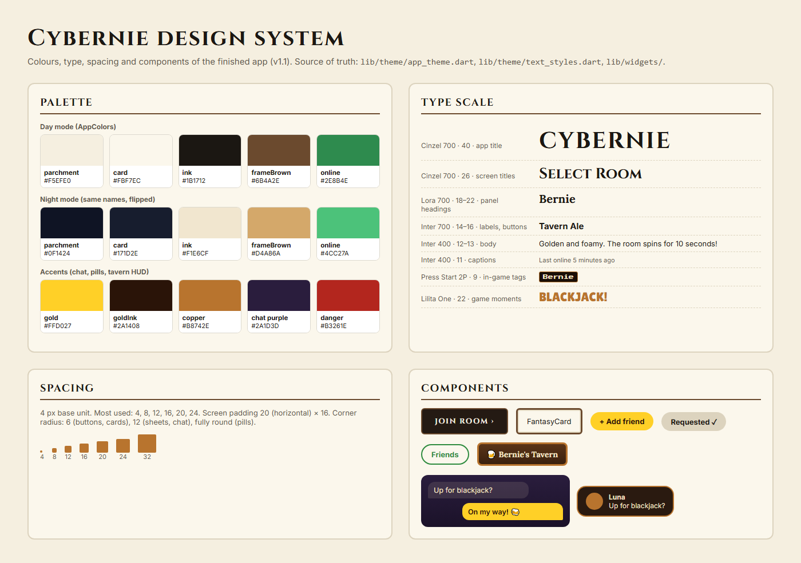

# Design system

The final design system of Cybernie (v1.1, 2026-10-09): a warm parchment and
wood fantasy look that matches the pixel art, with a night mode.

The code is the source of truth: colours live in `lib/theme/app_theme.dart`
(`AppColors`), text styles in `lib/theme/text_styles.dart` and the screens,
and reusable widgets in `lib/widgets/`.

## Palette

Every screen reads its colours from `AppColors` while it builds, so switching
night mode repaints the whole app with the same names.

| Name | Day | Night | Used for |
| --- | --- | --- | --- |
| `parchment` | `#F5EFE0` | `#0F1424` | screen backgrounds |
| `parchmentSoft` | `#E8DFC8` | `#1A2033` | inner panels, inputs |
| `parchmentDim` | `#DCD3BE` | `#2A3147` | dividers, disabled |
| `card` | `#FBF7EC` | `#171D2E` | cards and sheets |
| `ink` | `#1B1712` | `#F1E6CF` | text, dark buttons |
| `onInk` | `#FFFFFF` | `#141A2B` | text on `ink` buttons |
| `inkMuted` | `#5E574C` | `#BDB09A` | secondary text |
| `frameBrown` | `#6B4A2E` | `#D4A86A` | card frames, borders |
| `selectedTile` | `#241A13` | `#5A4426` | selected character / nav item |
| `online` | `#2E8B4E` | `#4CC27A` | online dots |

**Accents** (the same in both modes):

| Name | Colour | Used for |
| --- | --- | --- |
| gold | `#FFD027` | Add friend pill, my chat bubbles, highlights |
| gold ink | `#2A1408` | text on gold |
| copper | `#B8742E` | tavern HUD frames, banner ring, camera frames |
| chat purple | `#2A1D3D` → `#1B1229` | private chat background (gradient) |
| cream | `#F5E6C8` | text on dark tavern panels |
| danger | `#B3261E` | unread badges, errors |

## Type scale

| Style | Font | Size | Used for |
| --- | --- | --- | --- |
| App title | Cinzel 700 | 40 | splash and login title |
| Screen title | Cinzel 700 | 26 | screen headers |
| Panel heading | Lora 700 | 18 to 22 | tavern panels, Bernie's menu |
| Label / button | Inter 700 | 14 to 16 | buttons, item names |
| Body | Inter 400 | 12 to 13 | most text |
| Caption | Inter 400 | 11 | last seen, hints |
| In-game tag | Press Start 2P | 9 | Bernie's name plate |
| Game moment | Lilita One | 22 | blackjack results |

Inter is the workhorse (used about 60 times); Cinzel and Lora give the fantasy
feel in titles only, so body text stays easy to read.

## Spacing

- **Base unit: 4 px.** Values in use: 4, 8, 12, 16, 20, 24, 32.
- **Screen padding:** 20 horizontal, 16 vertical.
- **Corner radius:** 6 for buttons and framed cards, 12 for sheets and chat
  bubbles, fully round for pills and avatars.
- **Touch targets:** at least 44 px tall (buttons are 44 to 48).

## Components

| Widget | File | Parameters | Used on |
| --- | --- | --- | --- |
| `FantasyCard` | `fantasy_ui.dart` | `child`, `padding`, `fill`, `cornerSize` | Home, Select Room, Friends, Profile, Player profile |
| `FantasyButton` | `fantasy_ui.dart` | `label`, `onPressed`, `leading`, `showChevron`, `height`, `busy` | Home, Select Room, Profile, Player profile |
| `FramedIconButton` | `fantasy_ui.dart` | `icon`, `onPressed`, `tooltip`, `dark`, `size`, `badgeCount` | Select Room, Friends, Profile, Player profile |
| `CornerFramedBox` | `corner_framed_box.dart` | `child` | Login |
| `FriendPill` | `friend_pill.dart` | `state` (add / requested / friends), `onAdd`, `busy` | Friends, Add Friends |
| `PlayerAvatar` | `player_avatar.dart` | `photoUrl`, `radius`, `isOnline` | Friends, Profile, Player profile, chat, tavern panels, banners, leaderboard |
| `SpriteWalkPreview` | `sprite_walk_preview.dart` | `assetPath`, `sideAssetPath`, `facing`, `animate`, `columns`, `rows`, `frameDuration` | Home, Profile, Player profile |
| `DirectChatView` | `direct_chat_view.dart` | `friend`, `compact` | Private chat screen, tavern chat panel |
| `DmBannerHost` / `DmUnreadBadge` | `dm_banner.dart` | `child`, `friendId` | the whole app / Friends |
| `ProfileQrDialog` | `profile_qr_dialog.dart` | `playerId`, `playerName` | Profile |
| `KitPlate` / `KitCoin` | `kit_plate.dart` | `kit`, `child`, `padding`, `scale`, `width`, `height` | tavern HUD, blackjack |
| `CoinChip` | `coin_chip.dart` | (reads the coin balance itself) | tavern HUD, blackjack |
| `PlayingCardView` | `playing_card.dart` | `card`, `height` | blackjack |
| `LeaderboardPanel` | `leaderboard_panel.dart` | `onClose` | tavern, blackjack |

## Changes since the last version

- **2026-10-02:** The week 1 plan (Material 3 `ColorScheme.fromSeed`, purple
  seed) was replaced by the parchment and wood palette and the fantasy
  components, to match the pixel art. `PrimaryButton`, `RoomCard` and similar
  planned widgets became `FantasyButton` and `FantasyCard`.
- **2026-10-03:** Added night mode: the same colour names, flipped.
- **2026-10-06:** Added the copper tavern HUD kit (`KitPlate`) for the game
  screen.
- **2026-10-08:** Added the gold friend pill, the purple and gold private chat,
  and the copper-ringed message banner, matching the landing page.
